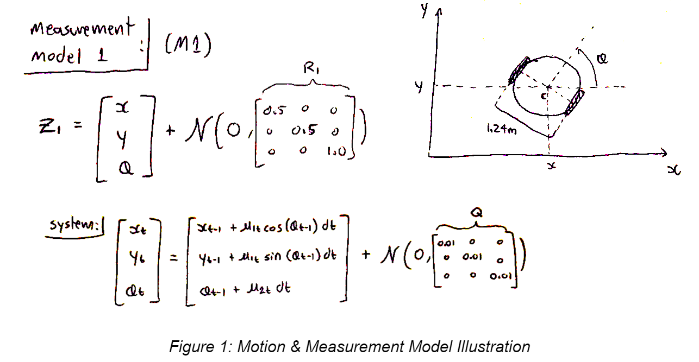
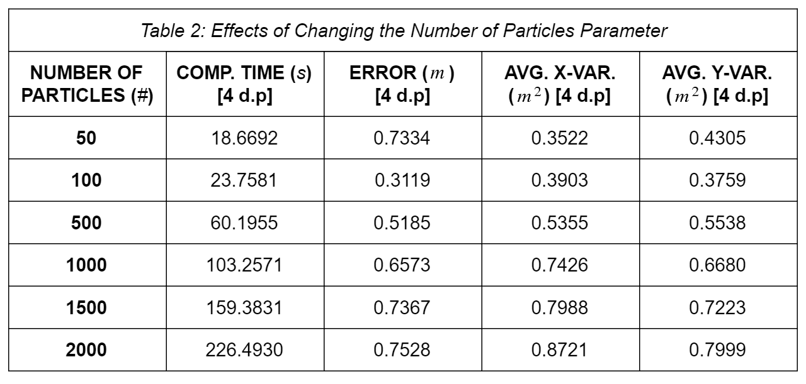

# Particle Filter Localization Investigation
Written in Python as part of an extended project on Autonomous Mobile Robotic Platforms.
Please refer to the .pdf for the project report. The main code is "PF_2.py"

